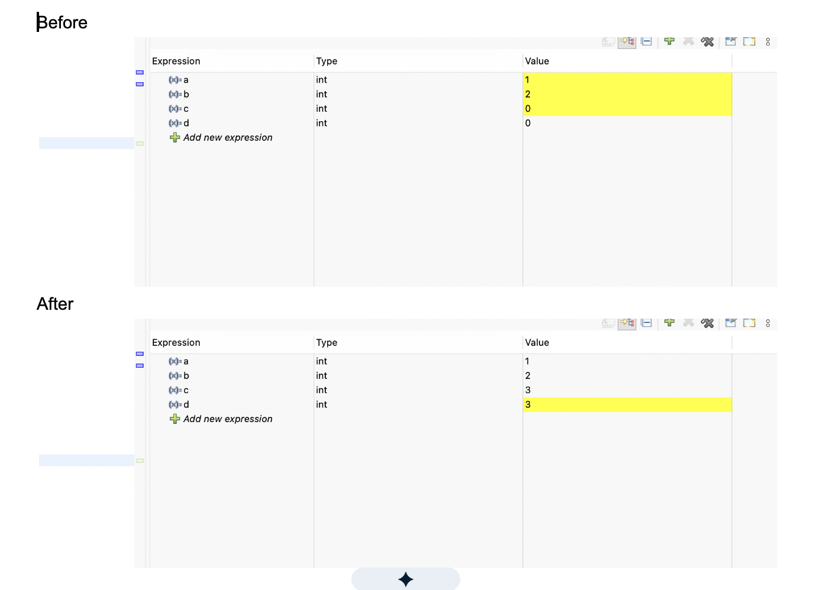

# ee186-lab1

2) Flashing & Debugging Code

Deliverables: 
When we flash the C code we wrote the complier coverts C into machine code and creates a binary file. On the MCU the memory that gets wrtten is NVS. STM32CubeIDE communicates to the board with ST-LINK (thats why if the board is not plugged in it will say ST-LINK not found)

3) Blinking LEDs
Deliverables:

4) Blinking LED (in Assembly!)
Deliverables: